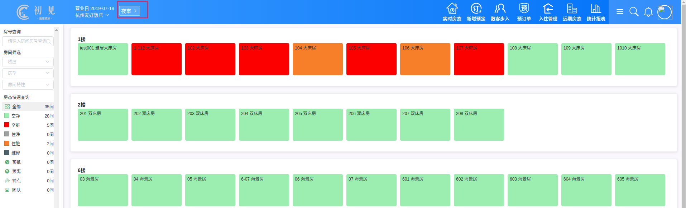
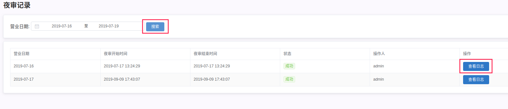
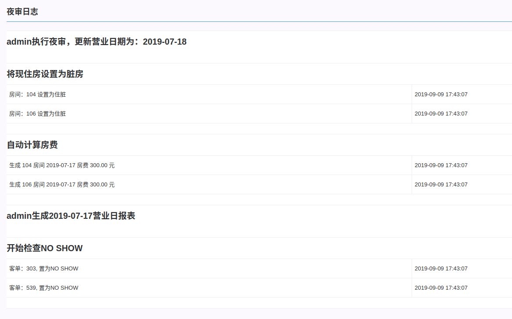

## 夜审
夜审是指对酒店当个营业日工作的总结、收尾。前准备工作：清当日预离，清预抵（预抵视情况而定，延到次日或者取消）查房价。然后点击夜审。

夜审过后，营业日会自动更新到第二天。
*****
点击**统计报表**，选择**其他报表**下的夜审记录表，选择要查看的日期，搜索

*****
点击**查看日志**，就可以看到那日夜审操作了哪些数据。主要为更新营业日，将住房置脏，生成夜审房费、营业日报表，预抵未来置为No show。

